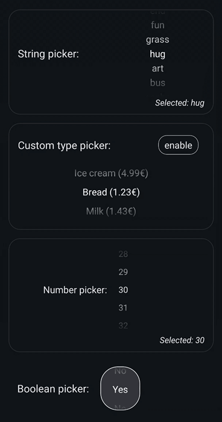
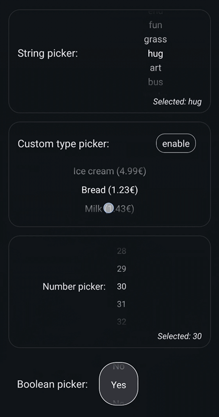
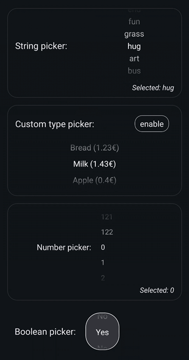

# Readme

A React Native wheel picker that allows endless scrolling through repeating content.
Supports custom types for picker data.


## Installation

```sh
npm install @pluto-whale-studio/repeating-wheel-picker
```


## Usage

```tsx
import RepeatingWheelPicker, {
  type RepeatingWheelPickerProps,
} from "@pluto-whale-studio/repeating-wheel-picker";

// ...
const [, setSelected] = useState<string>();

return (
  <RepeatingWheelPicker<string>
    setSelected={setSelected}
    initialIndex={0}
    data={["first", "second", "third"]}
  />
);
```


## Example

 

 


## Contributing

Contributions are currently not intended.


## License

[MIT](LICENSE)


## [Changelog](CHANGELOG.md)


## [Impressum / Imprint](https://pluto-whale-studio.github.io/#imprint)


---
